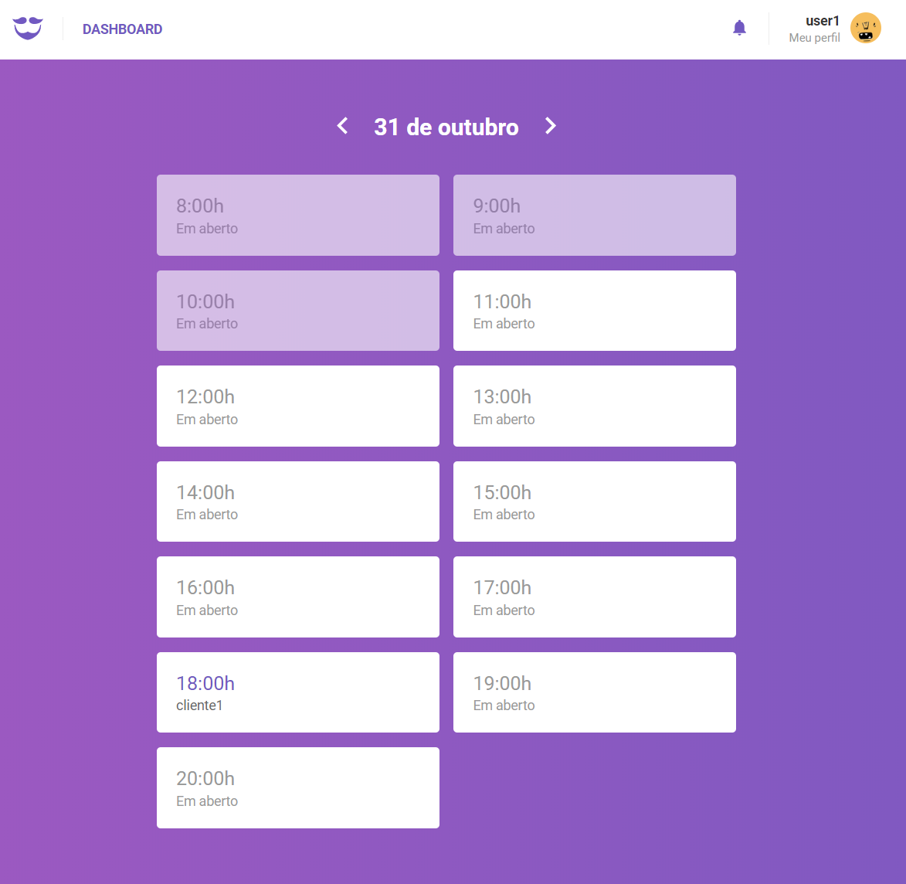

# goBarber

> Este projeto foi desenvolvido para gerenciar prestação de serviços, como salões de beleza, barbeiros e cabeleireiros. Foi utilizado as tecnologias: Node.js + Queue + ReactJS + React Native.

## Site

O site foi desenvolvido para o prestador de serviço cadastrar as horas livres e gerenciar os clientes.

<p align="center">
    
</p>

## Aplicativo

O aplicativo foi desenvolvido para o cliente escolher o prestador de serviço e gerenciar os agendamentos.

<p align="center">
    
    
    
</p>

## Iniciar a aplicacão :checkered_flag:

A aplicação está dividida em três partes, sendo elas: Backend, Frontend e Mobile.

## Backend

Depois de efetuar o download da aplicação, acesse a pasta `backend` e execute o comando abaixo para efetuar o download das dependências:

```console
yarn
```

_Depois renomeie o arquivo `.env.example` para `.env` e configure as variáveis de ambiente._

Execute o comando abaixo para criar as tabelas no banco de dados:

```console
npx sequelize-cli db:migrate
```

Para rodar a aplicação esteja na pasta `backend` e execute o comando:

```console
yarn dev
```

---

## Frontend

Acesse a pasta `frontend` e execute o comando abaixo para efetuar o download das dependências:

```console
yarn
```

_Depois renomeie o arquivo `.env.example` para `.env` e configure as variáveis de ambiente._

Para rodar a aplicação esteja na pasta `frontend` e execute o comando:

```console
yarn start
```

Em seguida, será aberto o endereço [http://localhost:3000](http://localhost:3000) em seu navegador.

---

## Mobile

Acesse a pasta `mobile` e execute o comando abaixo para efetuar o download das dependências:

```console
yarn
```

_Obs: Para configurar o ambiente acesse o [link](https://facebook.github.io/react-native/docs/getting-started.html)._

Para rodar a aplicação esteja na pasta `mobile` e execute o comando:

```console
npx react-native run-android
```
